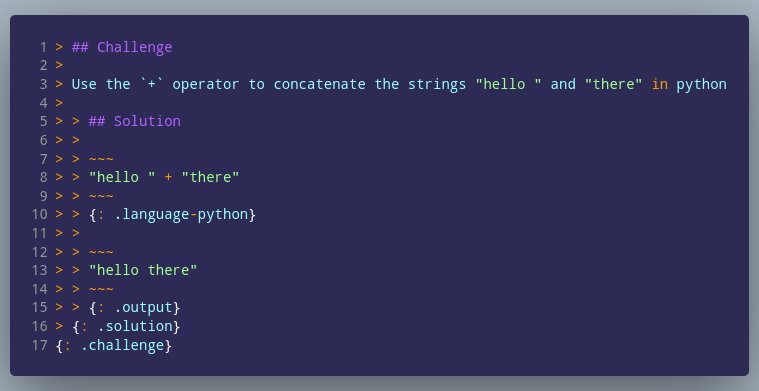

```{r setup, include = FALSE}
knitr::opts_chunk$set(
  collapse = TRUE,
  comment = "#>"
)
```

::::::::::::::::: questions :::::::::::::::::::::::::::::::::::

## Questions

 - What system of content generation seems easier to use for you?
 - How easy will it be to explain this to a newcomer?
 - What questions do you have for us?

:::::::::::::::::::::::::::::::::::::::::::::::::::::::::::::::

::::::::::::::::::::::::: prereq :::::::::::::::::::::::::::::

## Instructions

You will test out three methods of creating challenge/solution blocks and
fill out a short survey related to their ease use. (estimated time: 15 minutes)

This website contains reference pages for each of the syntaxes as well as two
pages containing challenges for you.

 1. Please go to <https://forms.gle/dFD9Xs2cNw8qnKts5> and follow the instructions
 1. Briefly examine [the three candidate syntaxes](#preview-reference) and rank them in the survey
 1. Open your favorite text editor and test out the three syntaxes for both [Simple Nested Challenge](06-simple-nested.html) and [Complex Nested Challenge](07-complex-nested.html)
 1. Paste your answers in the survey
 1. Answer the post-challenge questions in the survey

::::::::::::::::::::::::::::::::::::::::::::::::::::::::::::::

# Background

The nested challenge and solution blocks have been an integral part of The
Carpentries for quite a while and the provide a low-stakes way for learners to
test their knowledge. 

::::::::::::::::::::::::::::::: challenge :::::::::::::::::::

## Test your knowledge!

How are challenge and solution blocks created with the current *Jekyll*-based
lesson template?

:::::::::::::::::::: solution ::::::

## Solution

The challenge and solution blocks were created using [nested block quotes with
class attributes](02-jekyll-challenge-blocks.html):



::::::::::::::::::::::::::::::::::::
:::::::::::::::::::::::::::::::::::::::::::::::::::::::::::::

The goal of this lesson is to present three potential ways of creating content
blocks for rendering specialized sections in the new Carpentries lesson
template. **Your feedback will help us understand how comfortable our
maintainers will be with each of these formats** so that we can choose one that
we will use as our recommendation for creating these blocks.

# Preview/Reference

This nested challenge/solution block:

```{r dovetail, child = "files/div-challenge.Rmd", echo = FALSE, results = 'asis'}
```

Can be generated three ways:

### HTML div

[](03-div-challenge-blocks.html)

### Via the {dovetail} package

[](04-dovetail-challenge-blocks.html)

### Via pandoc fenced divs

[](05-fenced-div-challenge-blocks.html)

