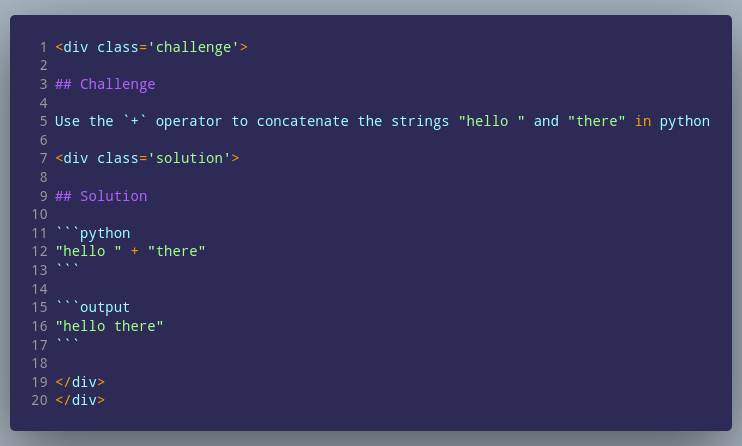
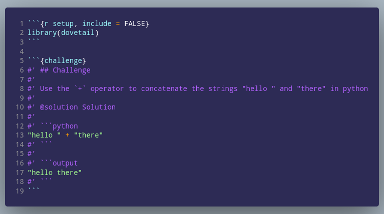
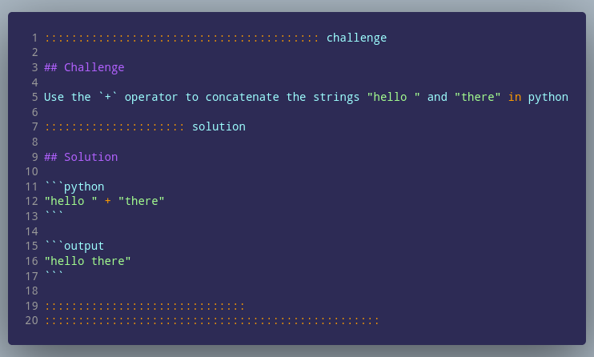

```{r setup, include = FALSE}
knitr::opts_chunk$set(
  collapse = TRUE,
  comment = "#>"
)
```

::::::::::::::::: questions :::::::::::::::::::::::::::::::::::

 - What system of content generation seems easier to use for you?
 - How easy will it be to explain this to a newcomer?
 - What questions do you have for us?

:::::::::::::::::::::::::::::::::::::::::::::::::::::::::::::::


# Before we start

This vignette is strictly temporary. The goal of this is to present three
potential ways of creating content blocks for rendering specialized sections in
the new Carpentries lesson template. Your feedback will help us understand how
comfortable our maintainers are with each of these formats so that we can choose
one that we will use as our recommendation for creating these blocks.

# Background

The nested challenge and solution blocks have been an integral part of The
Carpentries for quite a while and the provide a low-stakes way for learners to
test their knowledge. 

# Preview/Reference

This nested challenge/solution block:

```{r dovetail, child = "files/div-challenge.Rmd", echo = FALSE, results = 'asis'}
```

Can be generated three ways:

### HTML div



### Via the {dovetail} package



### Via pandoc fenced divs


