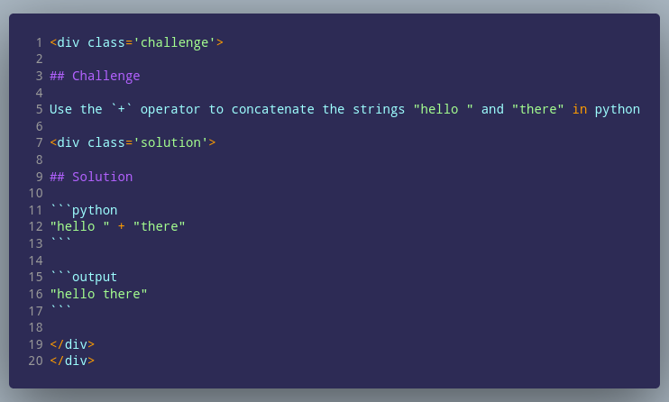

:::::::::::::::::: questions ::::::::::::::
## Questions

 - How is a block defined with `<div>` tags?

:::::::::::::::::::::::::::::::::::::::::::

# Challenge block div


:::::::::::::::::::::::::::::::::::::::::::::::::::::::: prereq

## Formatting

HTML tags can be used inside of markdown as long as they are [separated from
markdown content by blank lines](https://daringfireball.net/projects/markdown/syntax#html). 
Here, we use [div tags](https://developer.mozilla.org/en-US/docs/Web/HTML/Element/div) (short for "Content **div**ision") to create a our challenge and solution blocks.

### Defining block type

The type of block is determined by the `class` flag. **All div tags must have a closing tag** that is formatted exactly like this: `</div>`. For example:

````markdown
<div class='challenge'>

## Challenge

This is a *challenge*

</div>
<div class='callout'>

## Callout

This is a *callout*

</div>
````

### Nesting blocks

To nest div tags, open a new div tag without closing the previous tag. If an
opening tag does not have a matching closing (`</div>`) tag, then it is still
open and your prose is still within that block.

```markdown
<div class='challenge'>

## Challenge

This is a *challenge*

<div class='callout'>

## Callout

This is a *callout* inside a *challenge*

</div>

This is a *challenge* again

</div>
```


### What to watch out for

Be careful with indentation because markdown recognizes anything indented with
four spaces as code. Additionally, make sure you closing div tags start with a
slash and that there is no space between the `=` sign:

```markdown
<div class='callout'>

## Callout

Good

</div>

<div class = 'callout'>

## Callout

Bad (space between `=`)

</div>

    <div class='callout'>

    ## Callout
    
    Bad (will be processed as a code block)
    
    </div>
    
<div class='callout'>
## Callout

Bad (no space between tags and markdown)
</div>
```

::::::::::::::::::::::::::::::::::::::::::::::::::::::::


# Example

This shows an example of a solution div tag nested inside of a challenge div tag.



```{r div, child = "files/div-challenge.Rmd", echo = FALSE, results = 'asis'}
```

